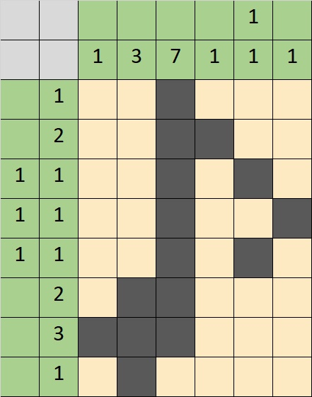

# PlayingWithNonograms
### Описание ###
Генератор нонограмм (японских кроссвордов). Функции, планируемые к реализации:
- Возможность решить одну из заранее сгенерированных нонограмм.
- Возможность загрузить изображение, которое впоследствии будет преобразовано в нонаграмму заданного пользователем размера.
- Возможность сохранить такую нонограмму и загрузить её.
- Решить собственную нонограмму тоже можно будет.
#### Участницы ####
- [Немешаева Алиса Алексеевна, 520 группа](https://github.com/rt2122)
- [Шастун Екатерина Алексеевна, 528 группа](https://github.com/kateya)

